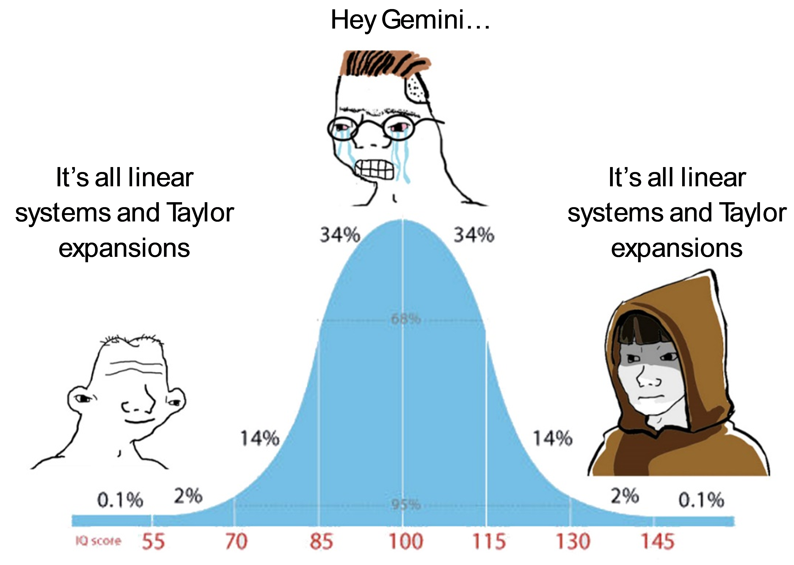

# Welcome

This online textbook is associated with the course EngPhys 3NM4 at McMaster University. 

Decompose into simpler problems. 

This is an introduction to the book. Below are the main sections:

* Boil everything down to a simple task (linear system of equations)
* Approximate functions as weighted sums of simpler functions (a linear basis)
* Expand functions as Taylor series 
* Achieve higher order accuracy by 
* * approximating higher order derivatives.
* * cancelling over and under prediction by averaging. 

AI is fast. Use your head before the computer or it will run away with you! 

[PDF of the full book](_static/book.pdf)

[Pretrained notepadlm](https://notebooklm.google.com/notebook/31dca965-3ce5-42e2-b423-c04bd11bfc98)

[Youtube channel with lectures](https://www.youtube.com/@McMaster_EngPhys3NM4)

[NotepadLM 'Audio overview'](https://notebooklm.google.com/notebook/a1f51dab-a729-4dfb-b94b-965be763a7b1/audio)
NB: The audio overview is AI generated from the notes. Although it is well grounded, it may still be incorrect.

This resource is being developed in part through the [McMaster University Open Educational Resources grant](https://mi.mcmaster.ca/oer-grant).

## Course Preamble & Timetable

Welcome to ENGPHYS 3NM4: Numerical Methods for Engineering. This textbook is structured to align directly with the course schedule, providing exactly one interactive notebook (chapter) per lecture day. 

The course consists of 3 lectures per week (Monday, Wednesday, Thursday).

### Week 1: Truncation and Round-off Error
* **Day 1:** Course Introduction
* **Day 2:** Round-off error and finite precision representations
* **Day 3:** True and approximate error, and truncation error

### Week 2: Linear Systems
* **Day 4:** Solvability (Over/Under-determined systems & the Pseudo-Inverse), Conditioning, and Complexity
* **Day 5:** Direct methods: Gaussian elimination, Diagonal dominance, and pivoting
* **Day 6:** Direct methods: LU decomposition, Matrix types, and sparsity

### Week 3: Linear Systems (Continued)
* **Day 7:** Iterative methods: Stationary methods
* **Day 8:** Iterative methods: Krylov subspace methods
* **Day 9:** Iterative methods: Preconditioners

### Week 4: Interpolation and Curve Fitting
* **Day 10:** Polynomial interpolation
* **Day 11:** Splines, Radial basis functions, and Summary of interpolation
* **Day 12:** Curve fitting (Linear least squares, Weighted, Polyfit, Best fit RBF)

### Week 5: Roots of Equations
* **Day 13:** Polynomial roots and Closed methods
* **Day 14:** Open methods (Newton-Raphson)
* **Day 15:** Basins of attraction and Global convergence methods

### Week 6: Optimization
* **Day 16:** Closed methods and Open methods (Gradient-based optimizers)
* **Day 17:** Indefinite systems and Trust region methods
* **Day 18:** Equality constraints, Nonlinear least squares, and Neural networks

*Midterm Break*

### Week 7: Numerical Differentiation
* **Day 19:** Finite difference (First-order derivatives)
* **Day 20:** Finite difference (Second-order and higher dimensions)
* **Day 21:** Even vs. uneven spacing, and Uncertainty amplification

### Week 8: Numerical Integration
* **Day 22:** Newton-Cotes formulae (Riemann's integrals, Trapezoid rule, Simpson's rules)
* **Day 23:** Romberg rule
* **Day 24:** Gaussian quadrature

### Week 9: Differential Equations (Initial Value Problems)
* **Day 25:** Explicit methods (Runge-Kutta) and Adaptive time stepping
* **Day 26:** Implicit methods, Stiffness, and Implicit Runge-Kutta
* **Day 27:** Multistep methods, Systems of equations, and Reduction of order

### Week 10: Boundary Value Problems and PDEs
* **Day 28:** Shooting method and Collocation methods
* **Day 29:** Finite difference method and Finite volume
* **Day 30:** Partial differential equations

### Week 11: Finite Element Method
* **Day 31:** Motivating example and Theoretical background
* **Day 32:** Elements, Discretization, and Assembly
* **Day 33:** Solution methods

### Week 12: Eigenvalue Problems
* **Day 34:** Eigenfunctions and Powers method
* **Day 35:** Matrix decomposition methods
* **Day 36:** Package tools

### Week 13: Project Presentations & Review
* **Day 37:** Project Presentations I
* **Day 38:** Project Presentations II
* **Day 39:** Final Course Review
